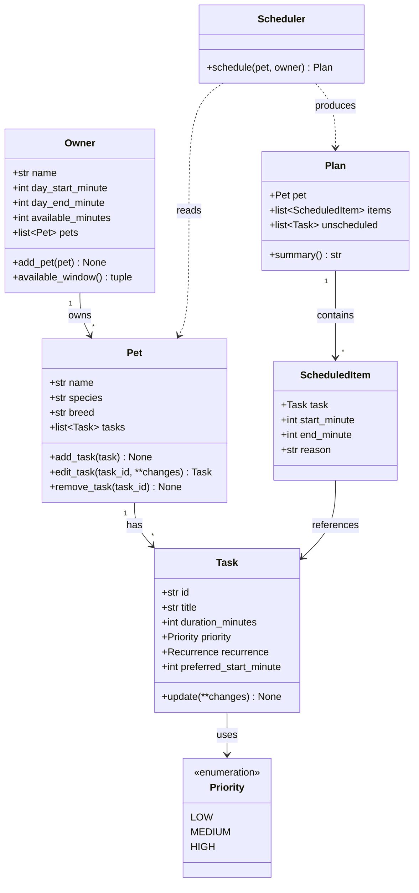

# PawPal+ Project Reflection

## 1. System Design

**a. Initial design**

My initial design separates **data** (what we know) from **behavior** (what we do with it),
so the scheduling logic never lives inside the UI. The full diagram is in
[diagrams/uml.mmd](diagrams/uml.mmd); it renders as:

**Classes and responsibilities**

The three core features map directly onto the classes:

| Core feature | Classes responsible |
|---|---|
| Add basic user & pet info | `Owner`, `Pet` |
| Add / edit a task | `Pet` (owns the task list), `Task`, `Priority`, `Recurrence` |
| Generate & display a scheduled plan per pet | `Scheduler`, `Plan`, `ScheduledItem` |

- **`Owner`** — holds owner info and the day-level constraints the scheduler must respect
  (waking window `day_start_minute`/`day_end_minute` and total `available_minutes`). Owns a
  list of `Pet`s via `add_pet()`. Storing times as integer *minutes from midnight* keeps the
  scheduling math simple and easy to test.
- **`Pet`** — basic identity (name, species, breed) plus the pet's own list of `Task`s. It is
  the single place tasks are created, edited, and removed (`add_task`, `edit_task`,
  `remove_task`), so editing a task is just mutating the list this class owns.
- **`Task`** — one care activity: `title`, `duration_minutes`, `priority`, `recurrence`, and an
  optional `preferred_start_minute`. Carries a stable `id` so the UI can edit a specific task
  without ambiguity when two tasks share a title.
- **`Priority` / `Recurrence`** — enums instead of free-text strings, so the scheduler can sort
  and filter on well-defined values and typos can't create a phantom priority level.
- **`Scheduler`** — the brain, and deliberately **stateless**: `schedule(pet, owner)` reads a
  pet's tasks plus the owner's constraints and returns a `Plan`. Keeping it stateless makes it
  trivial to unit-test with hand-built inputs and lets me schedule each pet independently.
- **`Plan`** — the result for one pet: the ordered `items` that fit, the `unscheduled` tasks
  that didn't, and a `summary()` for display. Separating scheduled from unscheduled makes the
  UI honest about what got dropped.
- **`ScheduledItem`** — a placed task with concrete `start_minute`/`end_minute` and a `reason`
  string, which is what powers the "explain the plan" requirement.

**Relationships:** `Owner` **1→\*** `Pet` **1→\*** `Task` (composition — a pet owns its tasks);
`Scheduler` *depends on* `Pet` and `Owner` and *produces* a `Plan` (no ownership, just data in /
data out); `Plan` contains many `ScheduledItem`s, each referencing the `Task` it placed.

**Suggested build order:** stub the data classes (`Owner`, `Pet`, `Task`, enums) → add
`Plan`/`ScheduledItem` → implement `Scheduler.schedule()` incrementally (sort by priority, then
pack into the available window) → write tests against `Scheduler` → wire the classes into
`app.py`, replacing the placeholder dicts and the "Generate schedule" button.

**b. Design changes**

- Did your design change during implementation?
- If yes, describe at least one change and why you made it.

---

## 2. Scheduling Logic and Tradeoffs

**a. Constraints and priorities**

- What constraints does your scheduler consider (for example: time, priority, preferences)?
- How did you decide which constraints mattered most?

**b. Tradeoffs**

- Describe one tradeoff your scheduler makes.
- Why is that tradeoff reasonable for this scenario?

---

## 3. AI Collaboration

**a. How you used AI**

- How did you use AI tools during this project (for example: design brainstorming, debugging, refactoring)?
- What kinds of prompts or questions were most helpful?

**b. Judgment and verification**

- Describe one moment where you did not accept an AI suggestion as-is.
- How did you evaluate or verify what the AI suggested?

---

## 4. Testing and Verification

**a. What you tested**

- What behaviors did you test?
- Why were these tests important?

**b. Confidence**

- How confident are you that your scheduler works correctly?
- What edge cases would you test next if you had more time?

---

## 5. Reflection

**a. What went well**

- What part of this project are you most satisfied with?

**b. What you would improve**

- If you had another iteration, what would you improve or redesign?

**c. Key takeaway**

- What is one important thing you learned about designing systems or working with AI on this project?
