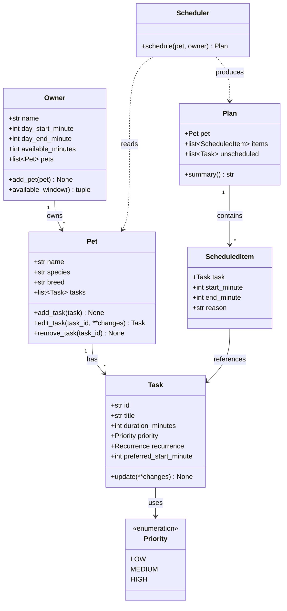

# PawPal+ Project Reflection

## 1. System Design

**a. Initial design**

My initial design separates **data** (what we know) from **behavior** (what we do with it),
so the scheduling logic never lives inside the UI. The full diagram is in
[diagrams/uml.mmd](diagrams/uml.mmd); it renders as:

**Classes and responsibilities**

The three core features map directly onto the classes:

| Core feature | Classes responsible |
|---|---|
| Add basic user & pet info | `Owner`, `Pet` |
| Add / edit a task | `Pet` (owns the task list), `Task`, `Priority`, `Recurrence` |
| Generate & display a scheduled plan per pet | `Scheduler`, `Plan`, `ScheduledItem` |

- **`Owner`** — holds owner info and the day-level constraints the scheduler must respect
  (waking window `day_start_minute`/`day_end_minute` and total `available_minutes`). Owns a
  list of `Pet`s via `add_pet()`. Storing times as integer *minutes from midnight* keeps the
  scheduling math simple and easy to test.
- **`Pet`** — basic identity (name, species, breed) plus the pet's own list of `Task`s. It is
  the single place tasks are created, edited, and removed (`add_task`, `edit_task`,
  `remove_task`), so editing a task is just mutating the list this class owns.
- **`Task`** — one care activity: `title`, `duration_minutes`, `priority`, `recurrence`, and an
  optional `preferred_start_minute`. Carries a stable `id` so the UI can edit a specific task
  without ambiguity when two tasks share a title.
- **`Priority` / `Recurrence`** — enums instead of free-text strings, so the scheduler can sort
  and filter on well-defined values and typos can't create a phantom priority level.
- **`Scheduler`** — the brain, and deliberately **stateless**: `schedule(pet, owner)` reads a
  pet's tasks plus the owner's constraints and returns a `Plan`. Keeping it stateless makes it
  trivial to unit-test with hand-built inputs and lets me schedule each pet independently.
- **`Plan`** — the result for one pet: the ordered `items` that fit, the `unscheduled` tasks
  that didn't, and a `summary()` for display. Separating scheduled from unscheduled makes the
  UI honest about what got dropped.
- **`ScheduledItem`** — a placed task with concrete `start_minute`/`end_minute` and a `reason`
  string, which is what powers the "explain the plan" requirement.

**Relationships:** `Owner` **1→\*** `Pet` **1→\*** `Task` (composition — a pet owns its tasks);
`Scheduler` *depends on* `Pet` and `Owner` and *produces* a `Plan` (no ownership, just data in /
data out); `Plan` contains many `ScheduledItem`s, each referencing the `Task` it placed.

**Suggested build order:** stub the data classes (`Owner`, `Pet`, `Task`, enums) → add
`Plan`/`ScheduledItem` → implement `Scheduler.schedule()` incrementally (sort by priority, then
pack into the available window) → write tests against `Scheduler` → wire the classes into
`app.py`, replacing the placeholder dicts and the "Generate schedule" button.

**b. Design changes**

Yes — the design changed in three notable ways during implementation:

1. **The `Scheduler` moved from per-pet to owner-wide.** The initial sketch had
   `schedule(pet, owner)` producing one `Plan` at a time. But the owner has a *single* daily
   time budget shared across all pets, so scheduling pets independently would let their totals
   double-count that budget. I changed it to `schedule(owner)`, which pulls every pet's tasks
   through a new `Owner.all_tasks()` aggregator, packs them into one shared timeline, and
   returns a `dict` of per-pet `Plan`s. This kept the Owner as the single source of truth for
   "what needs doing" instead of the scheduler reaching into each `Pet.tasks`.

2. **`Task` grew a `completed` flag and later a `due_date`.** Completion status wasn't in the
   first draft; it became necessary so the scheduler could ignore finished tasks and so the UI
   could show progress. `due_date` was added only in Phase 3 to support recurring tasks
   (`next_occurrence()` advances it with `timedelta`).

3. **Recurrence logic landed on `Pet`, not `Task`.** A `Task` doesn't know which `Pet` owns
   it, so it can't append its own follow-up. I added `Pet.complete_task()` to coordinate:
   mark the task done, then ask the task for its `next_occurrence()` and append it to the
   pet's list. This kept `Task` a clean data object and put list-mutation where the list lives.

---

## 2. Scheduling Logic and Tradeoffs

**a. Constraints and priorities**

The scheduler considers four things:

- **Priority** (`LOW`/`MEDIUM`/`HIGH`) — the primary sort key; important care wins contested slots.
- **Total available minutes** — the owner's daily time budget; once it's spent, remaining tasks go to `unscheduled`.
- **Waking window** (`day_start_minute`–`day_end_minute`) — nothing is placed outside it.
- **Preferred start time** — honored when the requested slot is still free; used as a tie-breaker in the sort otherwise.

I decided **priority matters most** because the scenario is a *busy* owner who may not get to
everything — so the guarantee that matters is "the most important care is what survives when
time runs short." Time budget is the hard constraint that makes those trade-offs necessary;
preferred time is a soft preference that yields to both. The sort key encodes exactly that
ranking: `(-priority, preferred_time, duration)` — priority first, then earliest preference,
then shortest task so a quick high-value task isn't blocked behind a long one.

**b. Tradeoffs**

**The scheduler packs greedily by priority in a single pass, rather than searching for a
globally optimal timetable.** `Scheduler.schedule()` sorts all pending tasks (highest priority
first, then earliest preferred time, then shortest) and lays them into one shared timeline,
placing each task at its preferred start *if that slot is still free*, otherwise in the next
open slot. It never backtracks. The visible consequence: a task can get bumped past its
preferred time — in the demo, Biscuit's "Morning walk" (preferred 08:00) is pushed to 08:10
because the equally-high-priority "Feeding" already took 08:00.

A related, deliberate split: **conflict detection is advisory, not enforced.**
`Scheduler.detect_conflicts()` reports overlapping *preferred* windows as warnings, but
`schedule()` still resolves them silently by shifting tasks later. So a "conflict" tells the
owner two things wanted the same slot; it doesn't block the plan.

**Why this is reasonable here:** the goal is a helpful daily suggestion for one busy owner, not
a provably optimal solver. Greedy packing is O(n log n), predictable, and easy to explain
("higher priority wins the slot; ties go to whoever's earlier/shorter") — which matters because
the app *shows its reasoning*. An optimal packer (e.g. constraint solver) would add a lot of
complexity for a handful of daily tasks where the greedy answer is already sensible, and its
choices would be far harder to justify in the per-task "↳ reason" line.

---

## 3. AI Collaboration

**a. How you used AI**

I used my AI coding assistant across the whole lifecycle, but for different jobs in each phase:

- **Design brainstorming** — turning my class ideas into a Mermaid UML diagram and pressure-testing responsibilities ("should recurrence live on `Task` or `Pet`?").
- **Scaffolding** — generating dataclass skeletons from the UML, then filling in method bodies incrementally.
- **Algorithm implementation** — writing the sorting, filtering, recurrence, and conflict-detection methods, and explaining Python tools I was less sure about (`timedelta`, `itertools.combinations`, `sorted()` with a lambda key).
- **Test generation and debugging** — drafting the pytest suite and diagnosing failures.

The most effective features were **agent/edit mode with access to multiple files at once**
(so a change like recurrence could touch `Task` and `Pet` together and be verified by actually
running `main.py` and `pytest`), and **inline explanation** — asking "explain this test before I
save it." The most useful prompts were *specific and constraint-bearing*: not "write a
scheduler," but "sort these tasks by preferred time, which is stored as integer minutes" — the
constraint changed the answer.

**Using separate chat sessions per phase kept me organized.** Keeping algorithm planning in a
different session from core implementation meant each conversation stayed focused on one
concern, and I could hand the assistant just the relevant files instead of a sprawling history —
which made its suggestions more on-target and easier for me to review.

**b. Judgment and verification**

One clear example: when I asked how to sort tasks by time, the assistant's first instinct
(following a common pattern) was to treat the time as an `"HH:MM"` **string** and sort with a
lambda that parses it. My design already stored time as **integer minutes-from-midnight**, so
I rejected that and kept a plain numeric sort — no parsing, no zero-padding bugs, and it reuses
the same representation the scheduler already relies on. The AI version was more "typical," but
worse for *my* system.

The opposite also happened: when I asked how to simplify `detect_conflicts`, the assistant
suggested replacing my index-based nested loops with `itertools.combinations`. Here the
Pythonic version was *also* clearer, so I accepted it.

I verified suggestions by **running them, not trusting them**: `python main.py` for behavior,
`python -m pytest` for regressions, and a headless Streamlit `AppTest` for the UI. That habit
caught a real problem — a test I'd been given was **misnamed** (`..._empty_when_no_overlap`)
but its fixture actually contained a conflict and asserted one was found. I split it into
honest, separately-named tests rather than keep a green-but-lying test.

---

## 4. Testing and Verification

**a. What you tested**

The suite (`tests/test_pawpal.py`, 13 tests) is split into happy paths and edge cases:

- **Task basics** — `mark_complete()` flips status; `add_task()` grows the list.
- **Sorting** — chronological order from out-of-order input, plus the empty-list case.
- **Filtering** — by pet name and by completion status.
- **Recurrence** — daily → next day (`+1`), weekly → `+7`, `ONCE` → no follow-up.
- **Conflict detection** — same-pet overlap, exact-same-time clash, and disjoint → no warnings.
- **Scheduler edge cases** — a pet with no tasks yields an empty plan; when time runs out, the lower-priority task lands in `unscheduled`.

These mattered because they cover the *decisions* the app makes on the owner's behalf — what
gets dropped when time is short, whether a "conflict" is real, and whether a completed daily
chore comes back tomorrow. Those are exactly the behaviors a user would be angry about if they
were silently wrong.

**b. Confidence**

**★★★★☆ (4/5).** The core logic is well covered and green, and I verified behavior end-to-end
(CLI + headless UI), not just via unit tests. I'm docking one star because untested areas
remain:

- Recurrence across **month/year boundaries** (does `timedelta` roll over correctly on July 31 / Dec 31? — it should, but it's untested).
- A `preferred_start_minute` that falls **outside the waking window**, or a task **longer than the whole budget**.
- **Multi-day** scheduling and what happens as queued recurrences accumulate over time.
- Conflict detection when tasks have **no preferred time** (currently skipped — is that the behavior we want?).

---

## 5. Reflection

**a. What went well**

I'm most satisfied with the **clean separation between the logic layer and the UI**. Because
`pawpal_system.py` has no Streamlit dependency, I could drive the exact same `Scheduler` from a
CLI demo, a pytest suite, and a headless `AppTest` — and the "explain the plan" feature
(`ScheduledItem.reason` → `Plan.summary`) came almost for free because the reasoning lives with
the data, not in the view. Keeping the `Scheduler` stateless made it trivial to test.

**b. What you would improve**

- **Give recurrence a real calendar.** Right now `due_date` advances but the scheduler only
  plans "today"; I'd make it date-aware so a weekly bath actually appears on the right day.
- **Turn conflicts into a choice.** Detection is advisory; I'd let the owner resolve a clash
  (reschedule / shorten / drop) instead of the scheduler silently shifting one task.
- **Unique task IDs.** The UI uses an incrementing counter and recurrence appends a date suffix;
  a small ID service (or UUIDs) would be cleaner than two ad-hoc schemes.

**c. Key takeaway**

The biggest lesson was what being the **"lead architect"** actually means with a powerful AI:
the AI is fast at producing *plausible, conventional* code, but "conventional" isn't the same as
"right for this system." The HH:MM-string sort was textbook — and wrong for my integer-minutes
design; a test it wrote was green — and lying. My job wasn't to write less code, it was to hold
the **design intent and the definition of "correct,"** and to verify everything by running it.
The AI accelerated the *how*; I still had to own the *what* and *why*.
